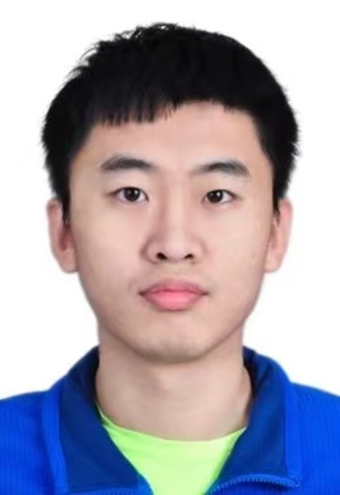

# Zhuangfei, Hu
- Phone: +86 15652663533	
- Email: zhu012@connect.hkust-gz.edu.cn

- Hi! My name is Zhuangfei Hu. I am currently a first-year PhD student in DSA Thrust, Information Hub, HKUST(GZ), supervised by [Prof. Yongqi Zhang](https://yzhangee.github.io/). 

## Education	
- Department of Computer Science and Technology- Tsinghua University- Beijing, China (Aug 2016-June 2020)
  - B.E. in Computer Science (conferred), Overall GPA: 3.68/4.00, Top 20%.
- China 3+1 Exchange Program (Mathematics)- University of Waterloo- Ontario, Canada (Sep 2019-May 2020)
- David R. Cheriton School of Computer Science- University of Waterloo- Ontario, Canada	(Fall 2020-Feb 2022)
  - Master of Mathematics (dropout)
- Related course grade:
   Calculus(1) (A); Linear Algebra(1) (A); Discrete Mathematics(1) (A-);  Calculus(2) (A); Linear Algebra(2) (A-); Probability and Statistics (A-); Numerical Analysis (A); Artificial Neural Networks (A-); Algorithm Design & Analysis (A)
- Awards & Scholarship:		
  - Tsinghua Toyota Scholarship	(2018-2019)
  - Outstanding Graduate Award in Department of Computer Science (2020)

## Research (work) Experience		                                                                                                                                                         
**Quantum Computation Theories | Tsinghua University | RA	(Apr 2018-Aug 2019)**
- **Advisor: Prof. Mingsheng Ying**
- Studied basic quantum computation theories and quantum algorithms
  
**Recovery from Non-decomposable Distance Oracles | RA	(May 2021-Feb 2023)**
- **Advisor: Assist. Prof. Hongyang Zhang & Prof. David P. Woodruff**
- Studied previous literature on distance-recovery problems
- Worked on constructing new recovery algorithms for non-decomposable distance metrics
- Worked on possible applications for new encodings

**isQ Programming Language | RA	(May 2023-July 2023)**
- **Advisor: Dr. Shenggang Ying**
- Implemented quantum algorithm libraries for isQ programming language
- Provided tests and feedback for isQ language design
  
**Quantum Diffusion Models for Image Generation | RA	(July 2023-Present)**
- **Advisor: Assist. Prof. Hongyang Zhang**
- Worked on quantum analog of latent diffusion models 
- Research goal: building quantum diffusion pipeline with the pennylane framework

## Publications                                                                                                                                                                                             
Zhuangfei Hu, Xinda Li, David P. Woodruff, Hongyang Zhang, and Shufan Zhang. Recovery from Non-Decomposable Distance Oracles. In 14th Innovations in Theoretical Computer Science Conference (ITCS 2023).

Hu, Zhuangfei, Xinda Li, David P. Woodruff, Hongyang Zhang, and Shufan Zhang. "Recovery from non-decomposable distance oracles." IEEE Transactions on Information Theory (2023).

## Skills	
Computer skills: C/C++, Python, LaTeX, Markdown, MATLAB  

Languages: Chinese Mandarin (Native), English (Fluent)

TOEFL: Total 105 (Reading 30, Listening 27, Speaking 21, Writing 27)

GRE: V.159 (83%), Q.170 (96%), W.4 (59%)

## CV
[A PDF version of my Personal CV](Zhuangfei_Hu_resume.pdf)
